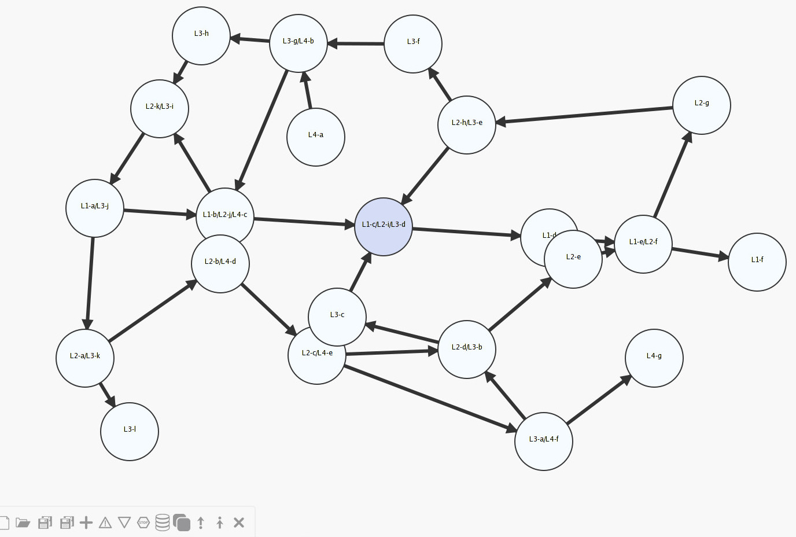
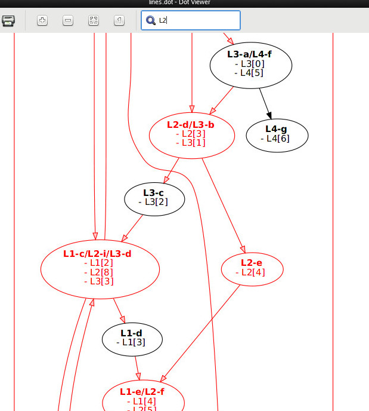
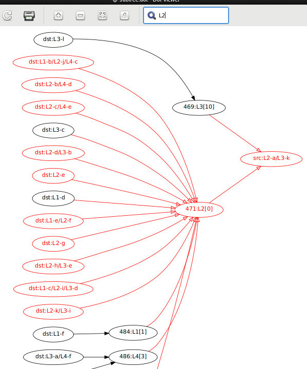

========================================
 trip-based-public-transit-routing-algo
========================================
----------------------------------------------------------------------
 Python implementation of trip-based public transit routing algorithm
----------------------------------------------------------------------

Implementation of the fast graph-based transit-routing algorithm from the
following papers:

- Trip-Based Public Transit Routing (`arXiv:1504.07149v2`_, 2015)
- Trip-Based Public Transit Routing Using Condensed Search Trees
  (`arXiv:1607.01299v2`_, 2016)

...with source data parsed (by cli script) from `GTFS feeds
<https://developers.google.com/transit/gtfs/>`_.

See "Links" section below for more references.

Not focused on performance too much, mostly data structures layout and
algo-correctness, i.e. just a proof of concept or reference code,
not suitable for any kind of production use.

|

.. contents::
  :backlinks: none


Usage
-----

There's command-line ``gtfs-tb-routing.py`` script that builds timetable from
GTFS source data, initializes routing engine with it and runs queries on that,
but routing engine itself can be used separately.

Regardless of interface, highly recommend using PyPy3 (3.3+) to run the thing,
as it gives orders-of-magnitude performance boost here over CPython, and
transfer-set pre-calculation with large datasets can take a while.

No dedicated attempt at parallelization or memory optimizations is made here,
so it might take much longer than necessary and eat all the RAM regardless.


Command-line script
```````````````````

Usage: ``./gtfs-tb-routing.py [options] gtfs-data-dir-or-file command ...``

For example, to run a profile query on an (unpacked) GTFS data from specified
dir and pretty-print resulting (pareto-optimal) JourneySet to stdout,
``query-profile`` command can be used::

  ./gtfs-tb-routing.py gtfs-data query-profile stop-A stop-B

See ``./gtfs-tb-routing.py --help`` command output for a full list of all
supported/implemented commands and options.

Some sample GTFS data zips can be found in ``test/`` directory.

Links to many open real-world GTFS feeds are available at `transit.land
<https://transit.land/>`_ repository.

Example usage::

  % unzip test/gtfs_shizuoka.data.2016-10-13.zip -d gtfs-shizuoka
  Archive:  test/gtfs_shizuoka.data.2016-10-13.zip
    inflating: gtfs-shizuoka/agency.txt
    inflating: gtfs-shizuoka/routes.txt
    inflating: gtfs-shizuoka/trips.txt
    inflating: gtfs-shizuoka/stops.txt
    inflating: gtfs-shizuoka/calendar_dates.txt
    inflating: gtfs-shizuoka/stop_times.txt
    inflating: gtfs-shizuoka/shapes.txt

  % ./gtfs-tb-routing.py gtfs-shizuoka \
      --debug --day 2016-10-14 \
      --cache-timetable gtfs-shizuoka.pickle \
      --cache-precalc gtfs-shizuoka.cache cache

  % ./gtfs-tb-routing.py gtfs-shizuoka.pickle -c gtfs-shizuoka.cache \
      query-earliest-arrival J22209723_0 J2220952426_0

  Journey set (1):
    Journey 33883d2af26ea29d (arrival: 08:43:00, trips: 2, duration: 02:33:00):
      trip [333]:
        from (dep at 06:10:00): 10:小川 [J22209723_0]
        to (arr at 06:55:00): 49:島田駅 北口２番のりば [J222093340_2]
      trip [341]:
        from (dep at 08:35:00): 20:島田駅 北口２番のりば [J222093340_2]
        to (arr at 08:43:00): 28:ばらの丘一丁目 [J2220952426_0]

  % ./gtfs-tb-routing.py gtfs-shizuoka.pickle -c gtfs-shizuoka.cache \
      query-earliest-arrival J22209843_0 J222093345_0

  Journey set (1):
    Journey 35cd107483780a29 (arrival: 07:41:00, trips: 2, duration: 00:39:00):
      trip [458]:
        from (dep at 07:02:00): 1:田代環境プラザ [J22209843_0]
        to (arr at 07:26:00): 20:島田駅 北口１番のりば [J222093340_1]
      footpath (time: 0:02:16):
        from: 島田駅 北口１番のりば [J222093340_1]
        to: 島田駅 北口２番のりば [J222093340_2]
      trip [26]:
        from (dep at 07:33:00): 38:島田駅 北口２番のりば [J222093340_2]
        to (arr at 07:41:00): 45:島田市民病院 [J222093345_0]


  % ./gtfs-tb-routing.py gtfs-shizuoka.pickle -c gtfs-shizuoka.cache \
      query-profile J22209723_0 J2220952426_0

  Journey set (7):

    Journey 3387dfa2a4cb3956 (arrival: 08:43:00, trips: 2, duration: 01:23:00):
      trip [174]:
        from (dep at 07:20:00): 10:小川 [J22209723_0]
        to (arr at 08:05:00): 49:島田駅 北口２番のりば [J222093340_2]
      trip [341]:
        from (dep at 08:35:00): 20:島田駅 北口２番のりば [J222093340_2]
        to (arr at 08:43:00): 28:ばらの丘一丁目 [J2220952426_0]

    Journey 338759bc528596df (arrival: 10:53:00, trips: 2, duration: 02:33:00):
      trip [54]:
        from (dep at 08:20:00): 10:小川 [J22209723_0]
        to (arr at 09:05:00): 49:島田駅 北口２番のりば [J222093340_2]
      trip [94]:
        from (dep at 10:45:00): 20:島田駅 北口２番のりば [J222093340_2]
        to (arr at 10:53:00): 28:ばらの丘一丁目 [J2220952426_0]
  ...


Note that ``cache`` command is used before queries to cache both timetable (for
a specific day and its vicinity) and precalculation result (lines, transfer set)
to avoid doing that for every subsequent query.

Queries above do not use calendar data, i.e. all trips from the timetable are
considered to be valid.

To use calendar data, **always specify -d/--day** (and maybe ``--parse-days``
and ``--parse-days-pre`` options) when building graph - i.e. "cache" command, or
when running query without cache opts.

Use ``--debug`` option to see pre-calculation progress (useful for large datasets)
and misc other stats and logging.


Python REPL (and IPython/Jupyter)
`````````````````````````````````

It'd probably make sense to generate graph cache beforehand, i.e. by running::

  % ./gtfs-tb-routing.py \
    gtfs-gbrail --stops-as-stations --debug --day 2017-05-13 \
    --cache-timetable gtfs-gbrail.pickle --cache-precalc gtfs-gbrail.cache cache

That will create "gtfs-gbrail.pickle" and "gtfs-gbrail.cache" files from source
data, which take much less time to load than building whole graph from GTFS (for
circa-2017 gbrain.info data on pypy 3.3 and circa-2012 desktop it takes ~30min).

Be sure to run the REPL in the project dir or have tb_routing importable there
in some other fashion.

::

  Python 3.3.5 (ea9979b550eeae87924dc4bef06070e8f8d0e22f, Oct 12 2016, 11:31:15)
  [PyPy 5.5.0-alpha0 with GCC 6.2.1 20160830] on linux
  Type "help", "copyright", "credits" or "license" for more information.
  And now for something completely different: ``apparently confusion is a
  feature''

  >>>> import tb_routing as tb
  >>>> tt, r = tb.init_gtfs_router('gtfs-gbrail.pickle', 'gtfs-gbrail.cache')
  >>>> journeys = r.query_profile('DIS', 'WWW')
  >>>> journeys
  ...
  >>>> journeys.pretty_print()
  ...

This should allow for easier tinkering, without needing to reload data caches on
every query.


Routing engine
``````````````

``tb_routing.engine`` module implements actual routing, and can be used with any
kind of timetable data source, passed as a ``tb_routing.types.public.Timetable``
to it on init.

Subsequent queries to engine instance return ``tb_routing.types.public.JourneySet``.

See `test/simple.py <test/simple.py>`_ for example of how such Timetable can be
constructed and queried with trivial test-data.


Requirements
````````````

- Python 3.x
- `attrs <https://attrs.readthedocs.io/en/stable/>`_
- (only if gtfs calendar.txt is used) `pytz <http://pytz.sourceforge.net/>`_
- (for tests only) `PyYAML <http://pyyaml.org/>`_
- (for Python<3.4 only) `pathlib <https://pypi.python.org/pypi/pathlib/>`_
- (for Python<3.4 only) `enum34 <https://pypi.python.org/pypi/enum34/>`_

To install all these on any random system (to ``~/.local/`` with ``--user``)::

  % python3 --version
  Python 3.3.5 (ea9979b550eeae87924dc4bef06070e8f8d0e22f, Oct 12 2016, 11:31:15)
  [PyPy 5.5.0-alpha0 with GCC 6.2.1 20160830]

  % python3 -m ensurepip --user
  % python3 -m pip install --user attrs pyyaml pytz

   ## For python<3.4 only, but safe to run on later ones as well
  % python3 -m pip install --user pathlib enum34

   ## Done, run the app/tests
  % ./gtfs-tb-routing.py --help
  ...
  % python3 -m unittest test.all

Alternatively, run ``python3 -m virtualenv tb-routing-venv &&
. tb-routing-venv/bin/activate`` before above commands to have these modules
installed into "tb-routing-venv" dir, if `virtualenv <https://virtualenv.pypa.io/>`_
module is installed/available (can be installed via pip same as others above).


Notes
-----

Some less obvious things are described in this section.


Calendar data
`````````````

Real-world GTFS feeds usually have calendar.txt or calendar_dates.txt files in
them (and e.g. gbrail.info even has links.txt for time-dependent footpaths),
which define whether specific sets of trips (services) are valid/invalid for
specific date/time ranges.

In addition to providing correct results, this info can be used to greatly
reduce the initial timetable (by not considering all trips that aren't valid for
specific day) and transfer set size (as some transfers aren't valid due to time
when trips' services operate).

So to work with any real-world feed, be sure to use ``-d/--day`` option (and
asoociated ones), as that'd both improve performance and provide correct results.

Default is to parse and consider all trips to be valid for all days.


Generated transfers/footpaths
`````````````````````````````

Not all GTFS data contains (optional) transfers.txt files, and sometimes these
are very slim or just empty.

Algorithm used here relies on having both "footpath" links between different
stops and even within same stop ("interchange time" - how soon one can board
different trip after exiting from the last one at the same stop).

So gtfs parser module, by default, generates fotpaths based on stop locations
(lon/lat) and a bunch of static parameters (like 2 min "base"
interchange/walking time and 5 km/h walking speed), if such data is missing or
doesn't even contain half of interchange times for stops.

Such generation process can be configured somewhat via ``tb_routing.gtfs.GTFSConf``.


Journey optimality criterias
````````````````````````````

Trip-Based algorithm, as described in the `arXiv:1504.07149v2`_ paper optimizes
earliest-arrival queries for two criterias:

- Earliest arrival time.
- Minimal number of transfers.

Profile queries there have additional criteria - latest departure time.

Result of this algorithm is a pareto-optimal set of trip-sequences (i.e. graph
nodes) that lead to optimal set of these parameters.

To construct journey info from such nodes (trips) in a deterministic and
somewhat sensible fashion, additional "minmal footpath time" criteria is used to
pick optimal edges (footpaths/interchanges), with earliest optimal footpath
preferred over later ones in case of ties.


Caching
```````

``--cache-timetable`` and ``-c/--precalc-cache`` options allow to cache
gtfs-processing/pre-computation results and re-use them between queries, which
can be very useful when working with non-trivial (e.g. real-world) datasets,

These options can and should be used together, or at least in that order, as
tuples in TransferSet dumped with ``-c/--precalc-cache`` refer to ids of objects
in Timetable.

``./gtfs-tb-routing.py ... --cache-timetable ... --cache-precalc ... cache``
command can be used to simply generate all the caches and exit.

``--cache-timetable`` uses pickle serialization, so can be quite slow,
especially when saving data.


Tests
`````

Commands to run tests from checkout directory::

  % python3 -m unittest test.all
  % python3 -m unittest test.gtfs_shizuoka
  % python3 -m unittest -vf test.simple

``test.all.case`` also provides global index of all test cases by name::

  % python3 -m unittest test.all.case.test_journeys_J22209723_J2220952426
  % python3 -m unittest test.all.case.testMultipleRoutes


Performance optimization
````````````````````````

Pre-calculation in Trip-Based routing algorithm, as noted in paper, is very
suitable for further optimization, especially on multi-core systems, where each
trip in the main loop there can be processed in parallel with minimal
synchronization.

Python does not provide an easy way to optimize such processing, especially due
to slow serialization of high-level objects and lack of support for cpu-bound
threads working in shared memory.

Workarounds are possible, but it's probably not worth considering python code
for any kind of production use.


Generating timetables from json-dgc graphs
``````````````````````````````````````````

`json-dgc <https://github.com/eimink/json-dgc/>`_ is a simple d3-based tool to
interactively draw and save/load directed graphs to/from JSON.

It can be used to draw some testing transport network, using nodes as stops,
positioning them as they'd be on a flat map (to auto-generate footpaths to ones
that are close) and naming/connecting them according to trip-lines.



``timetable-from-json-dgc.py`` script can then be used to convert saved JSON
graph into a pickled timetable, with trips auto-generated to run with regular
intervals (and some fixed speed) along drawn lines, and footpaths connecting
stops that are close enough.

Script requires node names to have following format::

  [<stop-id>:]L<line1>-<seq1>[/L<line2>-<seq2>]...

Where "line" is an arbitrary id for line (group of non-overtaking trips over
same stops at diff times), and "seq" is a string to sort stops for this line by,
e.g. stops/nodes [L1-a, L1-b, L1-c] will be grouped into same line with 3 stops
in that "a-b-c" order (alphasort).

Names like "L1-f/L5-a/L3-m" can be used when multiple lines pass through same stop.
Drawn edges aren't actually used by the script, node names/positions should have
all the necessary info.

See script itself for all the constants like train/footpath speeds, line trips
first/last times, intervals, stop arrival-departure deltas, etc.

``timetable-from-json-dgc.example.json`` is an example JSON graph, as produced
by json-dgc, and can be loaded/tweaked there or used as a template to generate
with some other tool (just two lists of all nodes / edges).

Generated timetable pickle file can be loaded by ``gtfs-tb-routing.py`` cli
script by simply pointing it to a file with pickled timetable instead of gtfs
dir.


Using graphviz to render internal graphs
````````````````````````````````````````

``gtfs-tb-routing.py`` script has ``--dot-...`` options to dump various internal
graphs in `graphviz "dot" format <http://www.graphviz.org/doc/info/lang.html>`_,
which can then be rendered by `graphviz <http://www.graphviz.org/>`_, one of its
wrappers or any similar tool.

When visualized, such graphs can be useful to understand what's happening
"under the hood" and easily identify potential issues at a glance.

For example, to render all stops and lines connecting them from
``timetable-from-json-dgc.example.json`` graph above and then open it in
`xdot <https://github.com/jrfonseca/xdot.py>`_ graphviz wrapper,
following commands can be used::

  % ./gtfs-tb-routing.py -t tt.pickle \
      --dot-for-lines lines.dot query-profile L2-a/L3-k L2-k/L3-i
  % xdot lines.dot



Or, to render a tree of transfer-patterns for a specified source stop::

  % ./gtfs-tb-routing.py -t tt.pickle \
      query-transfer-patterns --dot-for-tp-subtree tp-subtree.dot L2-a/L3-k L2-k/L3-i
  % xdot tp-subtree.dot



See ``-h/--help`` output for the script and relevant subcommands for more of these.


Missing things
--------------

- Transfer Patterns tree storage optimization ("Splitting Trees") as per
  `arXiv:1607.01299v2`_ paper.

  Proved to be rather difficult to implement in a more-or-less comprehensible
  fashion, complicates code quite a lot, is rather boring and slows down the
  actual queries, hence somewhat dubious.

- Profile queries using query trees can probably benefit from optimizations
  described in "Multi-criteria Shortest Paths in Time-Dependent Train Networks"
  paper.

- Some additional data from GTFS can be used, e.g. frequences.txt and names for
  services/trips/lines for more comprehensible results and easier introspection.

- Storing data in some db instead of memory and loading it selectively seem to
  be the most obvious practical optimization.

- Some interactive querying interface for long-running instance (e.g. webui or
  ipynb) can be useful for all kinds of experiments, in addition to existing
  caching code.


Links
-----

Papers/docs directly related to this project:

- Trip-Based Public Transit Routing (`arXiv:1504.07149v2`_, 2015)

- Trip-Based Public Transit Routing Using Condensed Search Trees
  (`arXiv:1607.01299v2`_, 2016)

  This paper relies heavily on algorithms and concepts described in:

  - Fast Routing in Very Large Public Transportation Networks using Transfer Patterns
    (`ACM:1888969 <https://dl.acm.org/citation.cfm?id=1888969&preflayout=flat>`_,
    `transferpatterns.pdf <http://ad.informatik.uni-freiburg.de/files/transferpatterns.pdf>`_, 2010)

  - Multi-criteria Shortest Paths in Time-Dependent Train Networks
    (`ACM:1788914 <https://dl.acm.org/citation.cfm?id=1788914&preflayout=flat>`_,
    `DisserMullerHannemannEtal2008.pdf
    <https://www.coga.tu-berlin.de/fileadmin/i26/download/AG_DiskAlg/FG_KombOptGraphAlg/paper/2008/DisserMullerHannemannEtal2008.pdf>`_,
    2008)

- `General Transit Feed Specification (GTFS) format info
  <https://developers.google.com/transit/gtfs/>`_

More on the subject:

- `Topical github awesome-transit list-repo <https://github.com/luqmaan/awesome-transit>`_

- `OpenTripPlanner (OTP) project <http://www.opentripplanner.org/>`_ + `Bibliography.md there
  <https://github.com/opentripplanner/OpenTripPlanner/blob/master/docs/Bibliography.md>`_

  Includes implementation of `RAPTOR
  <https://www.microsoft.com/en-us/research/wp-content/uploads/2012/01/raptor_alenex.pdf>`_ -like
  RoundBasedProfileRouter (see RepeatedRaptorProfileRouter.java and PR-1922 there).

- `Graphserver project <https://github.com/graphserver/graphserver/>`_

- `transit.land open GTFS transit data feeds/repository <https://transit.land/>`_

- Github orgs/groups related to transportation maps/routing:

  - `open-track <https://github.com/open-track>`_
  - `OpenTransport <https://github.com/OpenTransport>`_


.. _arXiv\:1504.07149v2: https://arxiv.org/abs/1504.07149
.. _arXiv\:1607.01299v2: https://arxiv.org/abs/1607.01299
